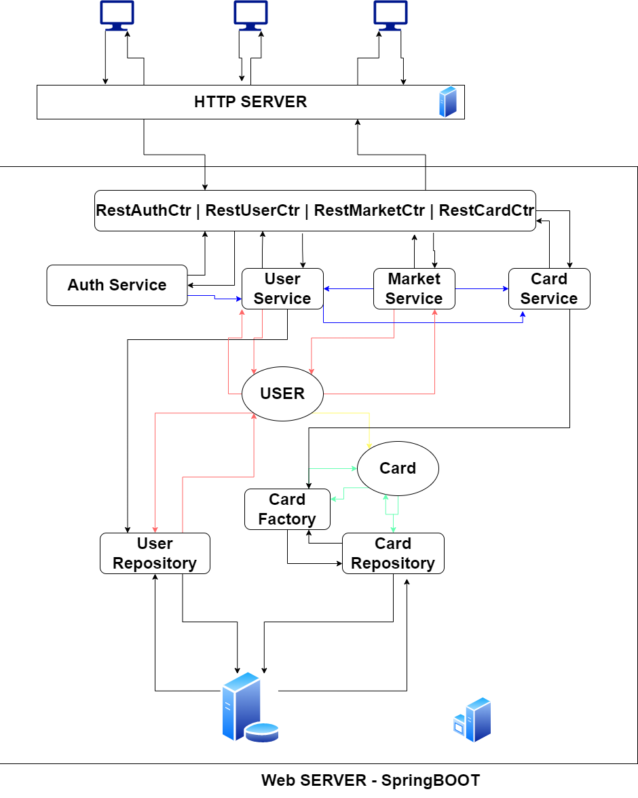

# archi-system-2

## Architecture gloable

### Routes

 - GET '/' : Renvoie la page d'accueil ou la page de login
 - Pour s'enregistrer:
   - GET '/login' : Renvoie la page de login
   - POST '/login' : Permet d'envoyer les infos de login
   - GET '/register' : Renvoie la page d'enregistrement
   - POST '/register' : Permet de s'enregistrer

 - Pour l'achat de cartes:
   - GET '/cards' : Renvoie la page d'achat de cartes, affichant toutes les cartes disponibles avec leurs infos
   - GET '/cards/:id' : Renvoie la page d'achat de la carte (id = id de la carte)
   - POST '/buy/:id' : Permet d'acheter une carte (id = id de la carte)
   - POST '/sell/:id' : Permet de mettre en vente une carte (id = id de la carte)
